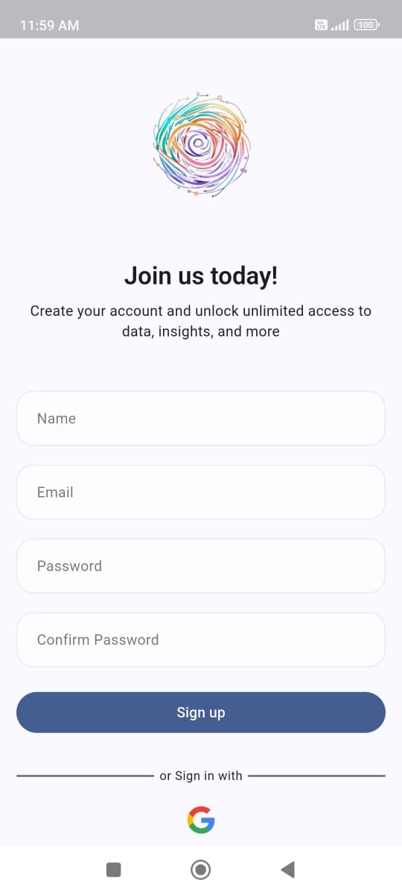
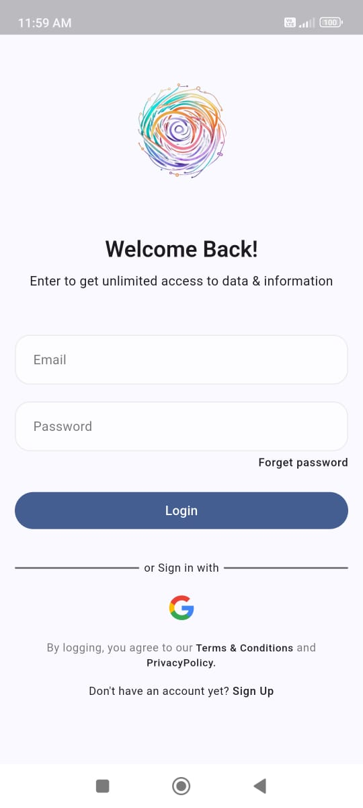
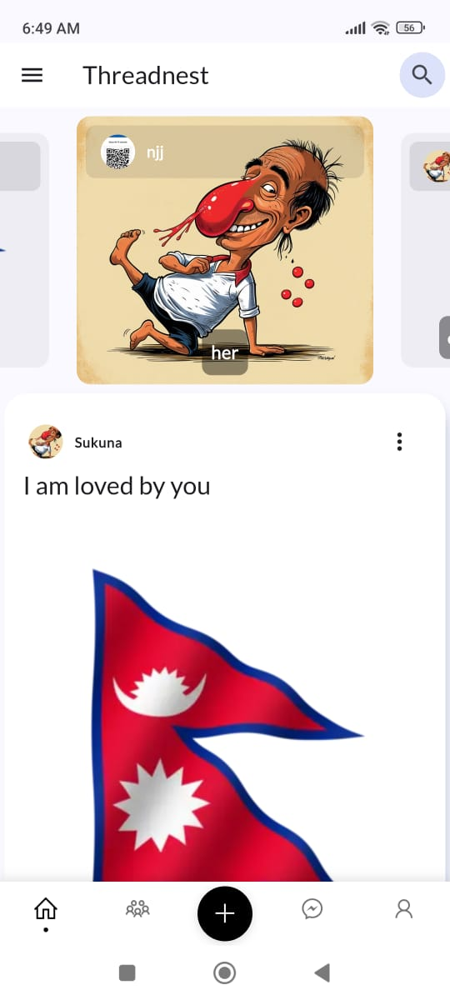
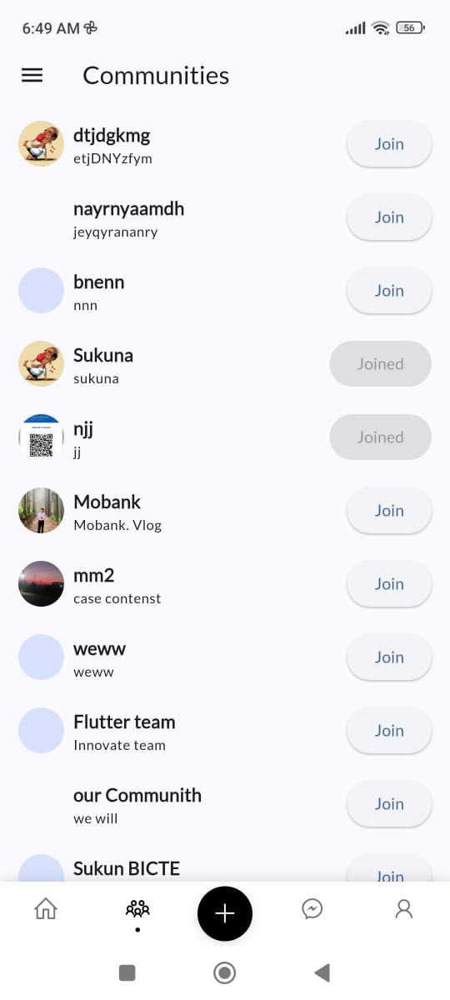
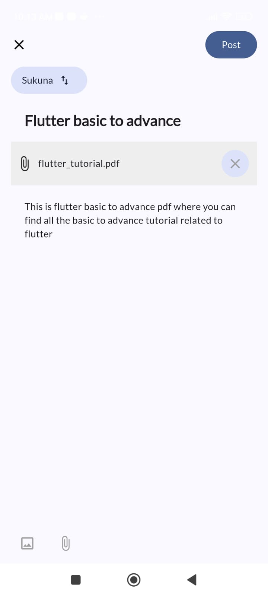
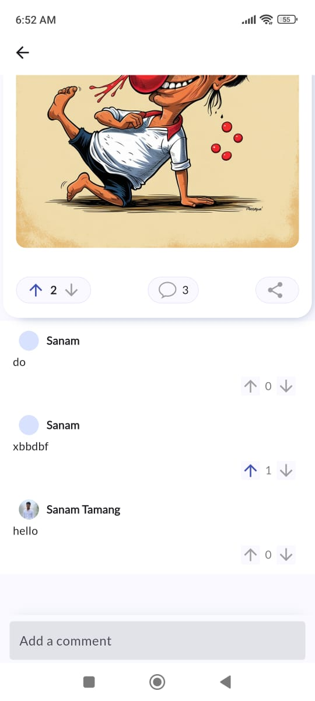
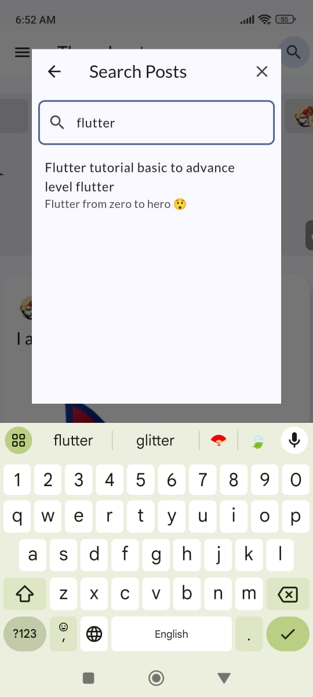
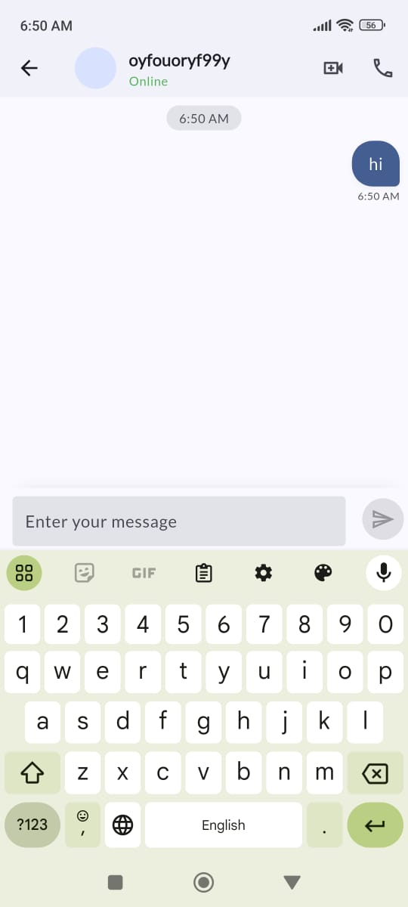

<body>
 <h1>ThreadNest Forum Software</h1>
    
ThreadNest is a community-driven forum software designed to foster engaging discussions, social interactions, and knowledge sharing. The platform allows users to sign up, join communities, create posts, interact through comments, and message other members.

<h2>Features</h2>
    <ul>
        <li><strong>User Sign-In/Sign-Up</strong>: Easy user authentication.</li>
        <li><strong>Community Creation & Management</strong>: Join or create communities based on interest.</li>
        <li><strong>Post Creation & Interaction</strong>: Create posts, comment, and interact with posts.</li>
        <li><strong>User Profiles</strong>: Users can update their profile information.</li>
        <li><strong>Real-Time Messaging</strong>: Message other community members.</li>
        <li><strong>Search Functionality</strong>: Search through posts,</li>
    </ul>

<h2>Screenshots</h2>

<h3>1. Sign-Up Page</h3>
    

    
<strong>Description:</strong> The registration screen where new users can sign up by providing their name, email , and password.

<h3>2. Sign-In Page</h3>
    

    
<strong>Description:</strong> The login screen where registered users can enter their credentials to access the platform.

<h3>3. Home Page</h3>
    

    
<strong>Description:</strong> The main page of the platform where users can navigate to various communities and explore recent posts.

<h3>4. List of Communities</h3>
    

    
<strong>Description:</strong> A list of available communities that users can join. Each community focuses on a specific topic of interest.

<h3>5. Create Post</h3>
    

    
<strong>Description:</strong> The page where users can create a new post in a community. They can add a title and content for the post.

<h3>6. Post Detail</h3>
    

    
<strong>Description:</strong> The detailed view of a post where users can read the full content, interact with the post by upvote/downvote or commenting, and view related discussions.

<h3>7. Profile Page</h3>
    

    
<strong>Description:</strong> The user's profile page where they can view and update their personal information, including profile picture and bio.

<h3>8. Search Page</h3>
    

    
<strong>Description:</strong> A search functionality where users can search for posts, 

<h3>9. Messaging</h3>
    

    
<strong>Description:</strong> The messaging feature that allows users to send private messages to other community members for direct interaction.

  <h2>Overview</h2>
  
This Flutter project integrates <strong>Supabase</strong> for database and server-side functionality, and <strong>Firebase</strong> for authentication and cloud messaging. Below, you will find details about the setup process, schema, functions, and triggers used in the project.

  <h2>Getting Started</h2>
  <ol>
    <li>
      <strong>Clone the repository:</strong>
      <pre><code>git clone &lt;https://github.com/sanam-tamang/threadnest&gt;</code></pre>
    </li>
    <li>
      <strong>Install dependencies:</strong>
      <pre><code>flutter pub get</code></pre>
    </li>
    <li>
      <strong>Set up Supabase:</strong>
      <ul>
        <li>Create a new project in <a href="https://supabase.com">Supabase</a>.</li>
        <li>Copy the API keys and URL and add them to the <code>lib/main.dart</code> file:</li>
      </ul>
    <pre><code>
        await Supabase.initialize(
    url: 'https://your-supabase-url.supabase.co',
    anonKey:
        'your-anon-key',
  );

</code></pre>
</li>
    <li>
      <strong>Set up Firebase:</strong>
      <ul>
        <li>Follow the <a href="https://firebase.google.com/docs/flutter/setup">official Firebase setup guide for Flutter</a>.</li>
        <li>Add your <code>google-services.json</code> (Android) and <code>GoogleService-Info.plist</code> (iOS) files to the respective directories.</li>
      </ul>
    </li>
  </ol>

  <h2>Database Schema</h2>
  <h3>Tables</h3>
  <pre><code>
  

CREATE TABLE users (
    id UUID DEFAULT uuid_generate_v4() PRIMARY KEY,
    created_at TIMESTAMP WITH TIME ZONE NOT NULL DEFAULT now(),
    name TEXT NULL,
    image_url VARCHAR NULL,
    bio VARCHAR NULL,
    email VARCHAR NOT NULL
);

-- Table: communities
CREATE TABLE communities (
    id UUID DEFAULT uuid_generate_v4() PRIMARY KEY,
    owner_id UUID NOT NULL REFERENCES users(id) ON DELETE CASCADE
);

-- Table: user_communities
CREATE TABLE user_communities (
    id UUID DEFAULT uuid_generate_v4() PRIMARY KEY,
    user_id UUID NOT NULL REFERENCES users(id) ON DELETE CASCADE,
    community_id UUID NOT NULL REFERENCES communities(id) ON DELETE CASCADE
);

-- Table: posts
CREATE TABLE posts (
    id UUID DEFAULT uuid_generate_v4() PRIMARY KEY,
    user_id UUID NOT NULL REFERENCES users(id) ON DELETE CASCADE,
    community_id UUID NOT NULL REFERENCES communities(id) ON DELETE CASCADE
);

-- Table: post_votes
CREATE TABLE post_votes (
    id UUID DEFAULT uuid_generate_v4() PRIMARY KEY,
    post_id UUID NOT NULL REFERENCES posts(id) ON DELETE CASCADE,
    user_id UUID NOT NULL REFERENCES users(id) ON DELETE CASCADE
);

-- Table: post_comments
CREATE TABLE post_comments (
    id UUID DEFAULT uuid_generate_v4() PRIMARY KEY,
    post_id UUID NOT NULL REFERENCES posts(id) ON DELETE CASCADE,
    commented_by UUID NOT NULL REFERENCES users(id) ON DELETE CASCADE
);

-- Table: post_comment_votes
CREATE TABLE post_comment_votes (
    id UUID DEFAULT uuid_generate_v4() PRIMARY KEY,
    comment_id UUID NOT NULL REFERENCES post_comments(id) ON DELETE CASCADE,
    voted_by UUID NOT NULL REFERENCES users(id) ON DELETE CASCADE
);

-- Table: removed_posts
CREATE TABLE removed_posts (
    id UUID DEFAULT uuid_generate_v4() PRIMARY KEY,
    post_id UUID NOT NULL REFERENCES posts(id) ON DELETE CASCADE,
    removed_by UUID NOT NULL REFERENCES users(id) ON DELETE CASCADE,
    community_id UUID NOT NULL REFERENCES communities(id) ON DELETE CASCADE
);

-- Table: rooms
CREATE TABLE rooms (
    id UUID DEFAULT uuid_generate_v4() PRIMARY KEY,
    user_id1 UUID NOT NULL REFERENCES users(id) ON DELETE CASCADE,
    user_id2 UUID NOT NULL REFERENCES users(id) ON DELETE CASCADE
);

-- Table: messages
CREATE TABLE messages (
    id UUID DEFAULT uuid_generate_v4() PRIMARY KEY,
    room_id UUID NOT NULL REFERENCES rooms(id) ON DELETE CASCADE,
    sender_id UUID NOT NULL REFERENCES users(id) ON DELETE CASCADE
);

</code></pre>

  <h3>Functions</h3>
  <h4 style="color: red; font-weight: bold;">Most follow</h4>

 
<h4> Get supabase function from <a href="/_database/custom_supabse_function.sql"> here  </a>  (/_database/custom_supabse_function.sql) </h4>
<h3> After copying paste this function to sql editor of supabase</h3>

</body>

